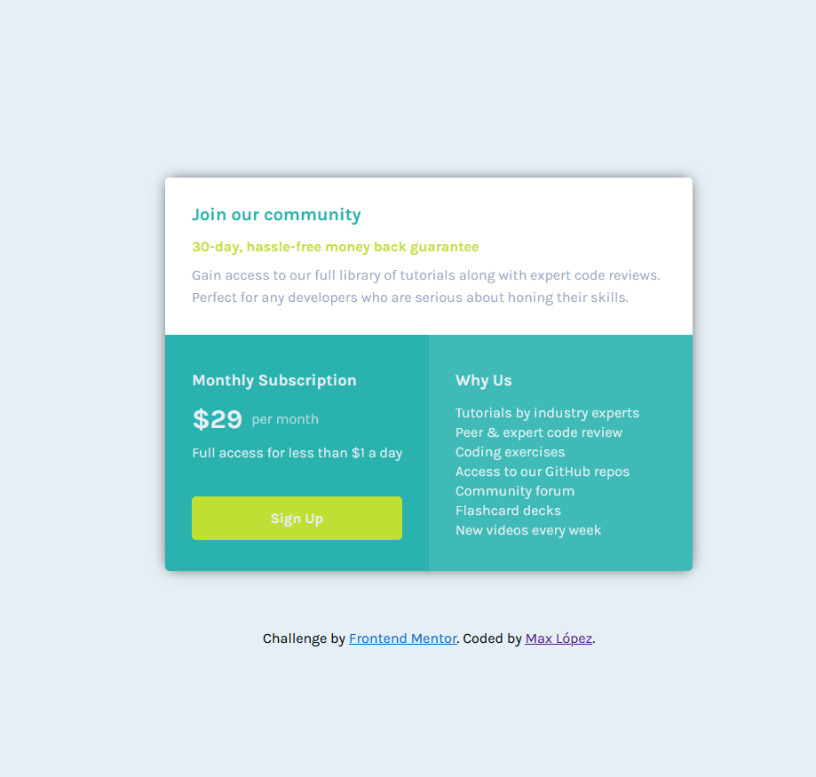

<<<<<<< HEAD
<<<<<<< HEAD
# single-price-grid-component
=======
# Frontend Mentor - Single price grid component solution

This is a solution to the [Single price grid component challenge on Frontend Mentor](https://www.frontendmentor.io/challenges/single-price-grid-component-5ce41129d0ff452fec5abbbc). Frontend Mentor challenges help you improve your coding skills by building realistic projects. 

## Table of contents

- [Overview](#overview)
  - [The challenge](#the-challenge)
  - [Screenshot](#screenshot)
  - [Links](#links)
- [My process](#my-process)
  - [Built with](#built-with)
  - [What I learned](#what-i-learned)
  - [Continued development](#continued-development)
  - [Useful resources](#useful-resources)
- [Author](#author)


## Overview

### The challenge

Users should be able to:

- View the optimal layout for the component depending on their device's screen size
- See a hover state on desktop for the Sign Up call-to-action

### Screenshot




### Links

- Solution URL: [Add solution URL here](https://your-solution-url.com)
- Live Site URL: [Add live site URL here](https://your-live-site-url.com)

## My process

### Built with

- Flexbox
- CSS Grid
- Media Queries


### What I learned

```html
<div class="container">
    <div class="join">
      <h1 class="join-title">Join our community</h1>

    <div class="join-subtitle">30-day, hassle-free money back guarantee</div>

    <div class="join-desc">Gain access to our full library of tutorials along with expert code reviews.<br>
      Perfect for any developers who are serious about honing their skills.</div>
    </div>
    <div class="sub-container">
      <div class="sub-sec">
        <h2>Monthly Subscription</h2>
  
        <div class="payment">&dollar;29 <span>per month</span></div>
  
        <div class="payment-info">Full access for less than &dollar;1 a day</div>
  
        <div class="sign-btn">Sign Up</div>
      </div>
  
      <div class="about-sec">
        <h2>Why Us</h2>
  
        Tutorials by industry experts<br>
        Peer &amp; expert code review<br>
        Coding exercises<br>
        Access to our GitHub repos<br>
        Community forum<br>
        Flashcard decks<br>
        New videos every week<br>
      </div>
    </div>
  </div>
```
```css
@media (max-width: 375px) {
    .container {
        margin-top: 200px;
    }

    .join-title {
        margin-bottom: 30px;
    }

    .join-subtitle {
        margin-bottom: 20px;
    }

    .join-desc {
        line-height: 30px;
    }

    .sub-container {
        display: grid;
        grid-template-columns: 1fr;
        max-width: 600px;
    }

    .sub-sec, .about-sec {
        border-radius: 0;
    }

    .about-sec {
        border-radius: 0 0 5px 5px;
    }
```

### Continued development

- Grid
- Flexbox

### Useful resources

- [Example resource 1](https://cssgenerator.org/box-shadow-css-generator.html) - This a great website to generate box shadow and to save time writing the code.

## Author

- Frontend Mentor - [@maxlopzb](https://www.frontendmentor.io/profile/maxlopzb)
- Twitter - [@maxlopzb17](https://twitter.com/maxlopzb17)

>>>>>>> 5a10aad (Single-price-grid-component-master)
=======
# single-price-grid-component
>>>>>>> 6472e22ec106a427e7da78b009e3d18b55833cbb
